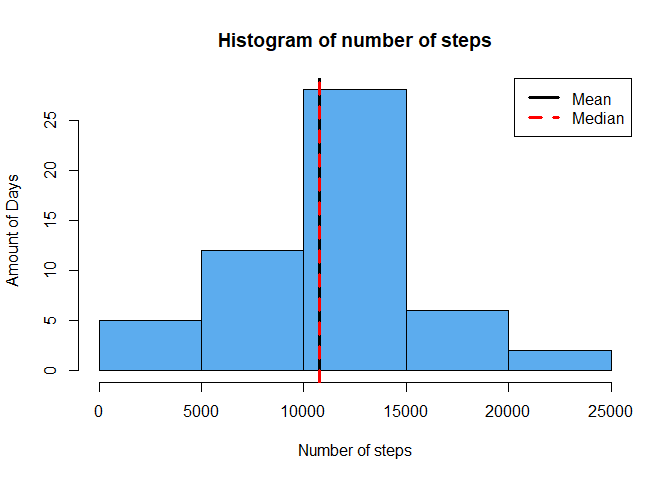
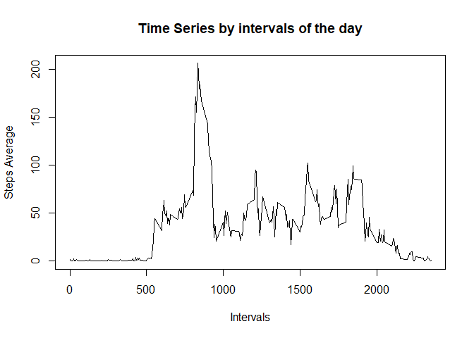
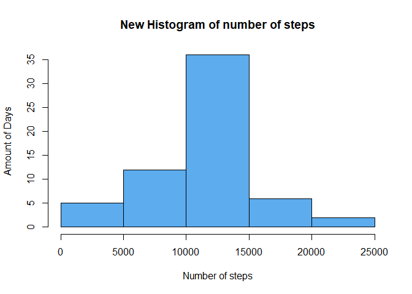
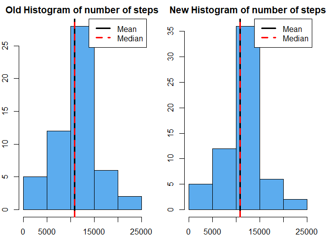
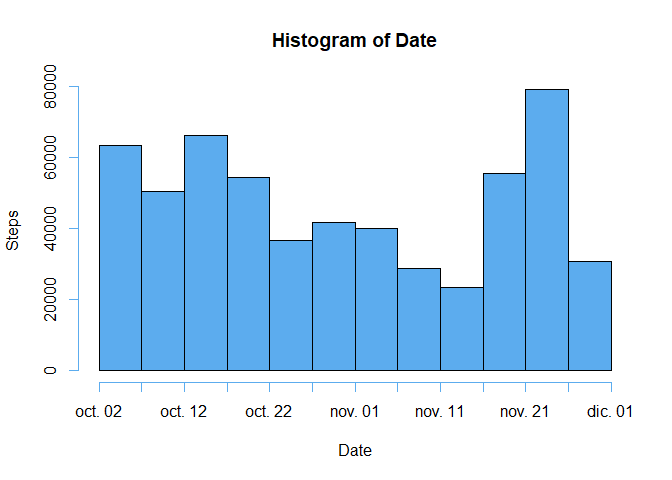

## Loading and preprocessing the data


Loading data:


```r
activity_data <- read.csv("./data/activity.csv")
str(activity_data)
```

```
## 'data.frame':	17568 obs. of  3 variables:
##  $ steps   : int  NA NA NA NA NA NA NA NA NA NA ...
##  $ date    : chr  "2012-10-01" "2012-10-01" "2012-10-01" "2012-10-01" ...
##  $ interval: int  0 5 10 15 20 25 30 35 40 45 ...
```

Converting the variable "date" to **Date** type and converting to **numeric** the remaining variables.


```r
activity_data$date <- as.Date(activity_data$date)
activity_data$steps<- as.numeric(activity_data$steps)
activity_data$interval<- as.numeric(activity_data$interval)
str(activity_data)
```

```
## 'data.frame':	17568 obs. of  3 variables:
##  $ steps   : num  NA NA NA NA NA NA NA NA NA NA ...
##  $ date    : Date, format: "2012-10-01" "2012-10-01" ...
##  $ interval: num  0 5 10 15 20 25 30 35 40 45 ...
```

## What is mean total number of steps taken per day?

Loading packages


```r
library(dplyr)
library(knitr)
```


Omitting **NA's**


```r
data <- activity_data[!is.na(activity_data$steps),]
```

Creating table with dates and its total steps


```r
total_steps<- data %>% group_by(date) %>% 
    summarise(steps = sum(steps)) %>% data.frame()
head(total_steps)
```

```
##         date steps
## 1 2012-10-02   126
## 2 2012-10-03 11352
## 3 2012-10-04 12116
## 4 2012-10-05 13294
## 5 2012-10-06 15420
## 6 2012-10-07 11015
```

Calculating the mean and median of total number of steps taken per day


```r
options(scipen=999) #This is to avoid sicentific notatio
steps_mean <- mean(total_steps$steps, na.rm = TRUE)
steps_median <- median(total_steps$steps, na.rm = TRUE)
steps_mean
```

```
## [1] 10766.19
```

The mean is **10766.1886792** and the median is **10765** for the total number of steps taken per day.


Now we plot the histogram.


```r
hist(total_steps$steps, xlab = "Number of steps", ylab = "Amount of Days",
     freq = TRUE, col = "steelblue2", main = "Histogram of number of steps")
abline(v = steps_mean, col = "black", lwd = 3, lty = 1)
abline(v = steps_median, col= "red", lwd=3, lty=2)
legend("topright",col = c("black","red"),
       legend = c("Mean","Median"), lty = c(1,2), lwd = 3 )
```

<!-- -->


## What is the average daily activity pattern?

Creating time series


```r
time_series <- activity_data %>% group_by(interval) %>% 
    summarise(steps = mean(steps, na.rm = TRUE))

maximun_pos <- which.max(time_series$steps)
maximun_interval <- time_series$interval[maximun_pos]
maximun_steps <- time_series$steps[maximun_pos]

plot(time_series, type = "l", xlab = "Intervals", ylab = "Steps Average",
     main = "Time Series by intervals of the day")
```

<!-- -->

The 5-minute interval with the maximun average steps is the interval **835** with **206.1698113** average steps.

## Imputing missing values

Calculating the number of NA's


```r
number_na <- sum(is.na(activity_data$steps))
```
There are **2304** of NA's in the data.

So to avoid missing values we have to fill the NA's, 
i decided to fill it with the mean of the same 5-minute interval of all days.
We will create another dataset. We will use the `time_series` to merge.

Merging with the 5-minute interval average and put them into NA.

```r
new_data <- merge(activity_data,time_series, by = "interval", 
                  suffixes = c("",".y"))
new_data <- new_data[order(new_data$date),] #Just ordering by date
time_series
```

```
## # A tibble: 288 x 2
##    interval  steps
##       <dbl>  <dbl>
##  1        0 1.72  
##  2        5 0.340 
##  3       10 0.132 
##  4       15 0.151 
##  5       20 0.0755
##  6       25 2.09  
##  7       30 0.528 
##  8       35 0.868 
##  9       40 0     
## 10       45 1.47  
## # ... with 278 more rows
```

```r
na_pos <- is.na(new_data$steps) #taking NA's position
new_data$steps[na_pos] <- new_data$steps.y[na_pos]
new_data <- new_data[1:3]
```


The new data looks like:


```r
head(new_data)
```

```
##     interval     steps       date
## 1          0 1.7169811 2012-10-01
## 63         5 0.3396226 2012-10-01
## 128       10 0.1320755 2012-10-01
## 205       15 0.1509434 2012-10-01
## 264       20 0.0754717 2012-10-01
## 327       25 2.0943396 2012-10-01
```

Look that the first intervals does not have NA's in the steps variable, they have an average instead.

Now we are going to do a table with total steps.


```r
new_total_steps <- new_data %>% group_by(date) %>%
    summarise(steps = sum(steps)) %>% data.frame()
```


Then calculating mean and median of the steps per day.

```r
new_steps_mean <- mean(new_total_steps$steps)
new_steps_median <- median(new_total_steps$steps)
```


The new steps mean and median are **10766.1886792** 
and **10766.1886792** respectively.


```r
hist(new_total_steps$steps, xlab = "Number of steps", ylab = "Amount of Days",
     freq = TRUE, col = "steelblue2", main = "New Histogram of number of steps")
```

<!-- -->

We now compare the old and new histrogram:


```r
par(mfrow = c(1, 2), mar = c(2,2,2,2) )

hist(total_steps$steps, xlab = "Number of steps", ylab = "Amount of Days",
     freq = TRUE, col = "steelblue2", main = "Old Histogram of number of steps")
abline(v = steps_mean, col = "black", lwd = 3, lty = 1)
abline(v = steps_median, col= "red", lwd=3, lty=2)
legend("topright",col = c("black","red"),
       legend = c("Mean","Median"), lty = c(1,2), lwd = 3 )

hist(new_total_steps$steps, xlab = "Number of steps", ylab = "Amount of Days",
     freq = TRUE, col = "steelblue2", main = "New Histogram of number of steps")
abline(v = new_steps_mean, col = "black", lwd = 3, lty = 1)
abline(v = new_steps_median, col= "red", lwd=3, lty=2)
legend("topright",col = c("black","red"),
       legend = c("Mean","Median"), lty = c(1,2), lwd = 3 )
```

<!-- -->

There is not a significant change in the new histogram and the mean and median are very similarly.

|DATA       |Mean              |Median              |
|---------|:----------------:|-------------------:|
|new data | 10766.1886792   |10765    |
|old data |10766.1886792|10766.1886792|


## Are there differences in activity patterns between weekdays and weekends?

Creating a data frame with a day's name column and a weekend column.


```r
weekend <- c("sábado","domingo")
no_weekend <- c("lunes","martes","miércoles","jueves","viernes")
col1 <- c(rep("weekday",5), rep("weekend",2)) %>% factor()
data_week <- data.frame(week = col1, day = c(no_weekend,weekend))
```

Now merge `data_week` with `new_data`, i.e. merge the original data with the table of weekdays.


```r
part_week <- new_data
part_week$day <- weekdays(new_data$date)

part_week <- part_week %>% merge(data_week, by = "day") 
```

It looks like:


```r
head(part_week)
```

```
##       day interval steps       date    week
## 1 domingo     2040    35 2012-10-21 weekend
## 2 domingo     2000    12 2012-10-21 weekend
## 3 domingo     2035    20 2012-10-21 weekend
## 4 domingo     2240     0 2012-10-21 weekend
## 5 domingo     2245     0 2012-10-21 weekend
## 6 domingo     2005   219 2012-10-21 weekend
```


Creating data frames with Average of 5-minut interval per day, for weekday and weekends.


```r
prueba <- part_week %>% group_by(week,interval) %>% 
  summarise(steps = mean(steps)) %>% data.frame() 

entre_semana <- subset(prueba, week == "weekday")
fin_semana <- subset(prueba, week == "weekend" )
```

Ploting time series of weekdays and weekeend.


```r
par(mfrow = c(2,1), mar = c(4,4,2,2))

plot(entre_semana[,2:3], type = "l", lwd = 1.5, col = "blue",
     main = "Weekdays",xlab = "", ylab = "Average Steps")
plot(fin_semana[,2:3], type = "l", lwd = 1.5, col = "blue",
     main = "Weekend", xlab = "Interval", ylab = "Average Steps")
```

<!-- -->

There are big differences in both time series, in general there are more activity on weekends than weekdays and it makes sense.
